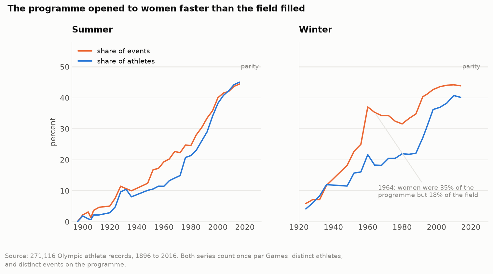
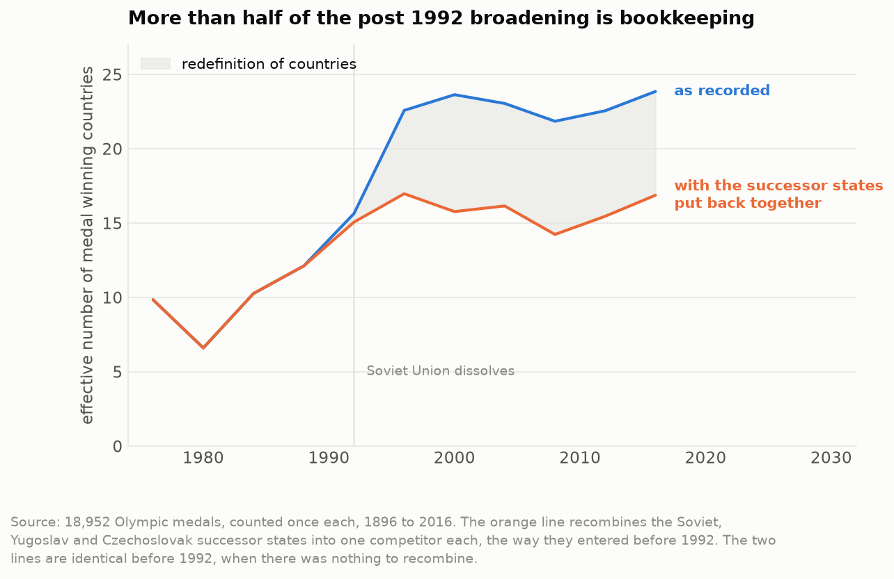

# Analyze Olympic Medal Trends

Medal and participation trends across 120 years of the Olympic Games, from 1896 to 2016.

> **In progress.** This README is deliberately thin. House rule on this project: the README
> is written last, from measured numbers pulled out of the phase reports in `docs/`, and it
> never carries a placeholder figure. Until the analysis is finished, `PLAN.md` is the
> document to read.

## What this is

A study of 271,116 athlete by event records covering 51 Games, 230 National Olympic
Committees, 66 sports and 765 events. It answers four questions:

1. How has participation changed, and how has the share of women changed?
2. How concentrated are medals among a small set of countries, and when did that shift?
3. Does hosting raise a country's medal share, and by how much?
4. Can next Games medal share be predicted better than simply repeating the last Games?

The point of the project is the handling rather than the plotting. Five defects in this
dataset are measured and fixed before anything is charted, the largest being that team
medals are stored once per athlete: 39,783 athlete medal rows collapse to 18,952 medals
actually awarded. That figure is 47 higher than the dedupe every public notebook on this
dataset uses, because collapsing on country and medal also throws away the cases where one
country won two of the same medal in one event. `PLAN.md` lists all five defects.

## Two figures from the work so far

The share of events open to women ran ahead of the share of women actually competing for
about thirty years. In the Winter Games that gap peaked at 17.0 points in 1964. By 2016 the
Summer gap had closed and slightly reversed.

Medals look like they spread more than twice as wide after 1992. Put the successor states
back together and 57 percent of that broadening disappears. The usual telling of this
dataset quotes the uncorrected number.

## Data

One public CSV, no account and no API key required. See `docs/sources.md` for the full
provenance chain and `docs/SETUP.md` to reproduce the environment.

## Layout

<table>
<tr><td><code>PLAN.md</code></td><td>the plan, the known defects, and the phase breakdown</td></tr>
<tr><td><code>docs/</code></td><td>sources, setup, and one machine readable report per phase</td></tr>
<tr><td><code>notebooks/</code></td><td>numbered analysis notebooks</td></tr>
<tr><td><code>scripts/</code></td><td>data download, checks, and the phase push helper</td></tr>
<tr><td><code>reference/</code></td><td>hand made lookup tables: NOC to country, and host nation per Games</td></tr>
<tr><td><code>src/</code></td><td>reusable code the notebooks import</td></tr>
<tr><td><code>reports/figures/</code></td><td>figures, tracked in git because the README embeds them</td></tr>
<tr><td><code>tests/</code></td><td>assertions on data grain and on evaluation discipline</td></tr>
</table>

## Progress

<table>
<tr><td>Phase 0</td><td>scaffold, environment, data acquisition</td><td>done</td></tr>
<tr><td>Phase 1</td><td>cleaning and the NOC to country map</td><td>done</td></tr>
<tr><td>Phase 2</td><td>participation trends</td><td>done</td></tr>
<tr><td>Phase 3</td><td>medal concentration</td><td>done</td></tr>
<tr><td>Phase 4</td><td>host advantage</td><td>next</td></tr>
<tr><td>Phase 5</td><td>forecast against a persistence baseline</td><td>pending</td></tr>
<tr><td>Phase 6</td><td>write up</td><td>pending</td></tr>
</table>

## Credit

Data collected by Randi H Griffin from `sports-reference.com`, published on Kaggle, and
mirrored by the TidyTuesday project. Full links in `docs/sources.md`.
